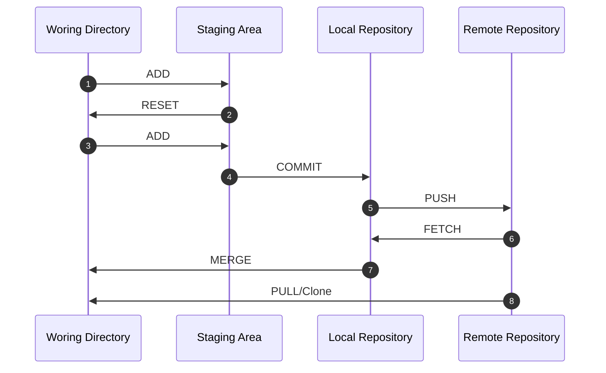

# Basic

## Overview
- 분산형 버전 관리 시스템 (Version Control System, VCS)의 한 종류, 빠른 수행 속도에 중점을 둔다.
- 

## Git FlowChart

## Git Glossary
- **Working Directory**: 작업 디렉토리, 실제 파일이 존재하는 디렉토리
- **Staging Area**: 커밋을 수행할 파일들을 선택하는 영역
- **Local Repository**: 로컬 저장소, 커밋을 수행한 파일들이 저장되는 영역
- **Remote Repository**: 원격 저장소 (ex. Github, Gitlab, Bitbucket 등)
- **ADD**: Working Directory에서 Staging Area로 이동
- **COMMIT**: Staging Area에서 Local Repository로 이동
- **PUSH**: Local Repository에서 Remote Repository로 이동
- **FETCH**: Remote Repository에서 Local Repository로 이동
- **MERGE**: Local Repository에서 Working Directory로 이동
- **PULL**: Remote Repository에서 Working Directory로 이동
- **Clone**: Remote Repository에서 Local Repository로 이동
- **RESET**: Staging Area에서 Working Directory로 이동