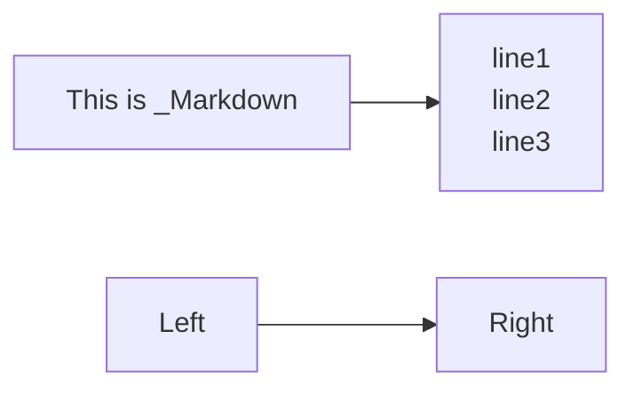
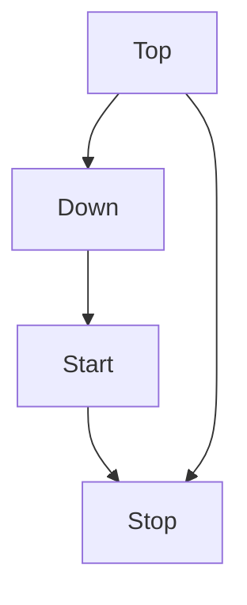
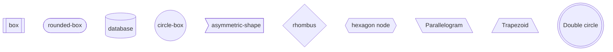
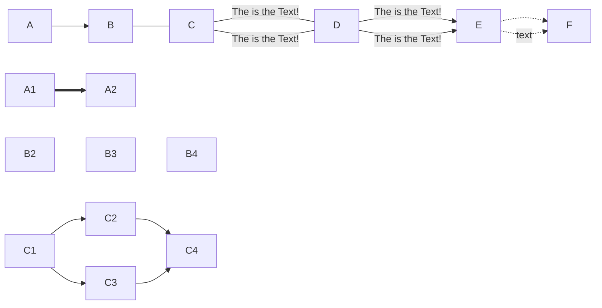
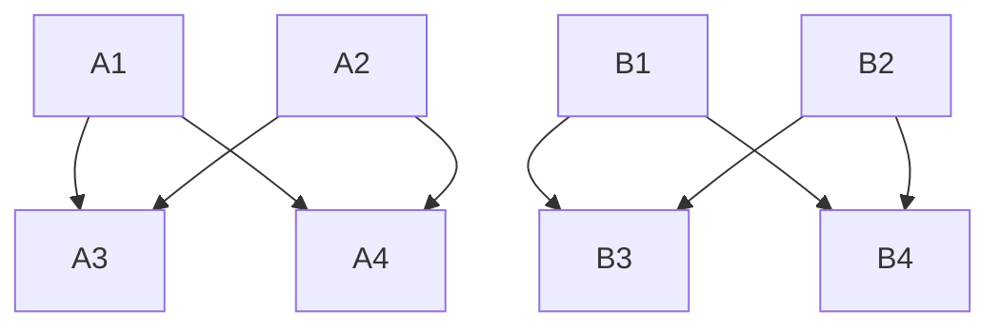
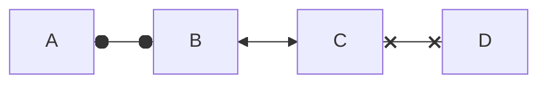
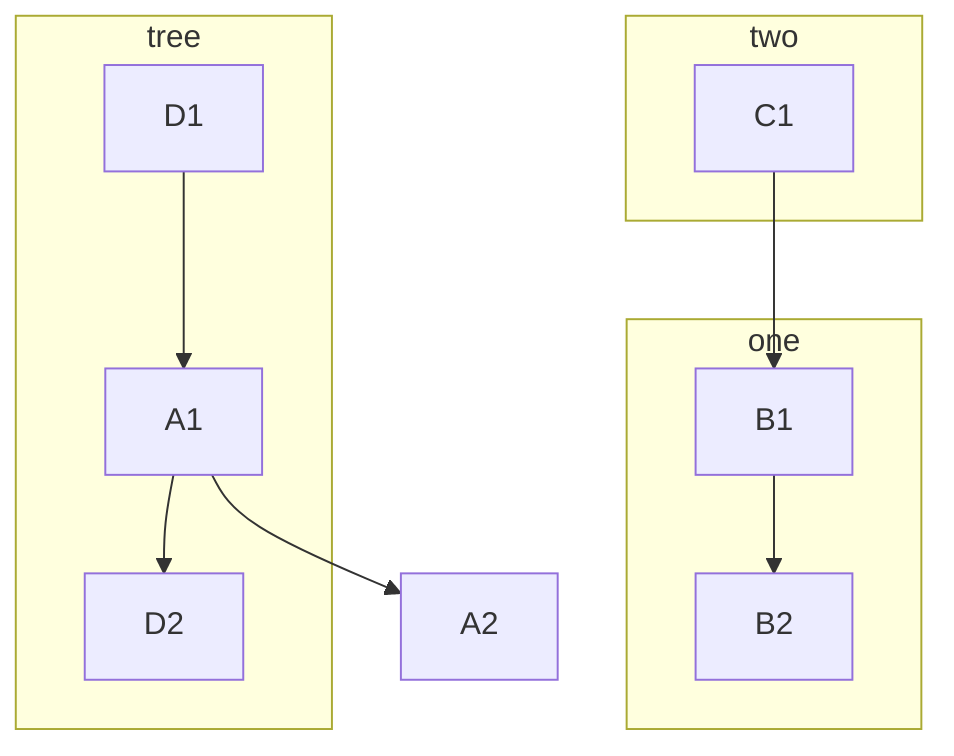
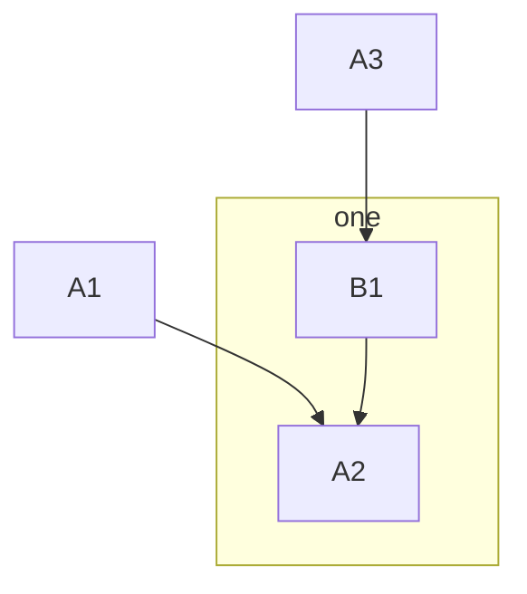
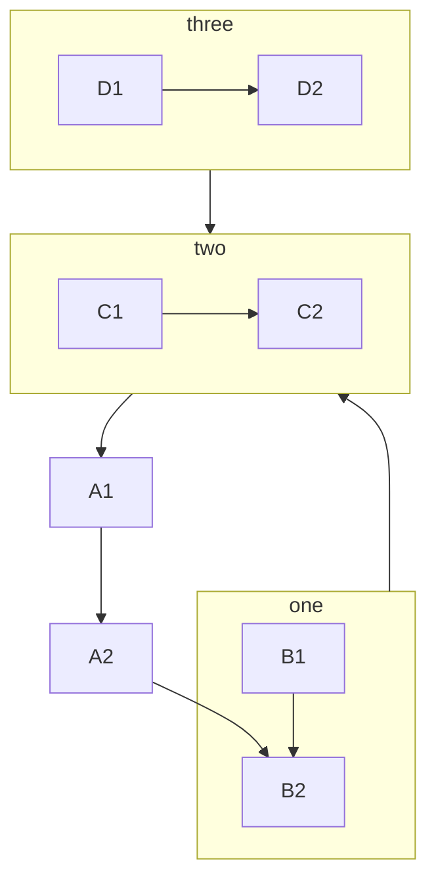

# Flowchart

### 1. Horizen



```
flowchart LR
    markdown["This is _Markdown"]
    newLine["
        line1
        line2
        line3
    "]

    markdown --> newLine
    Left --> Right
```

### 2. Vertical



```
flowchart TD
    Start --> Stop
    Top --> Down
    Down --> Start
    Top --> Stop
```

### 3. Box


```
flowchart TD
    box[[box]]
    rouned-box([rounded-box])
    database[(database)]
    circle-box((circle-box))
    asymmetric-shape-left>asymmetric-shape]
    rhombus{rhombus}
    hexagon-node{{hexagon node}}
    Parallelogram[/Parallelogram/]
    Parallelogram[\Parallelogram\]
    Trapezoid[/Trapezoid\]
    Double-circle(((Double circle)))
```

### 4. Links between nodes



```
flowchart LR
    A-->B
    B---C
    C-- The is the Text! ---D
    C---| The is the Text! |D
    D-->| The is the Text! |E
    D-->| The is the Text! |E
    E-.->F
    E-. text .->F
    A1 ==> A2
    B2 ~~~ B3 ~~~ B4
    C1 --> C2 & C3 --> C4
```


```
flowchart TB
     A1 & A2 --> A3 & A4
     B1 --> B3
     B1 --> B4
     B2 --> B3
     B2 --> B4
```



```
flowchart LR
    A o--o B
    B <--> C
    C x--x D
```

5. Subgraphs


```
    flowchart TB
        A1-->A2
        subgraph one
        B1-->B2
        end
        subgraph two
        C1-->B1
        end
        subgraph tree
        D1-->A1-->D2
        end
```


```
flowchart TB
    A1-->A2
    A3-->B1
    subgraph id [one]
    B1-->A2
    end
```


```
flowchart TB
    A1-->A2-->B2
    subgraph one
        B1-->B2
    end
    subgraph two
        C1-->C2
    end
    subgraph three
        D1-->D2
    end
    one --> two
    three --> two
    two --> A1
```
