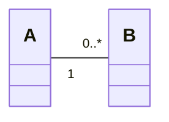
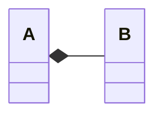
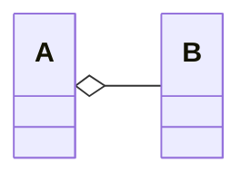
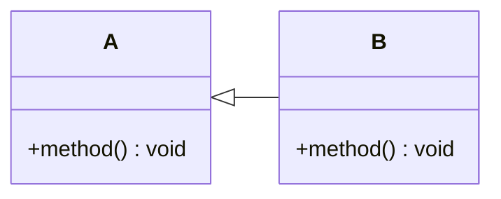
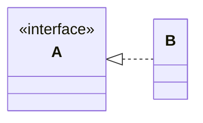
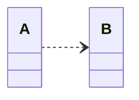
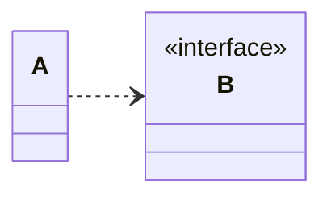
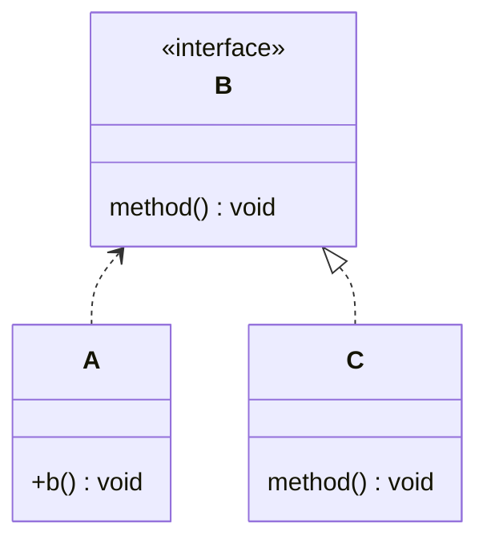

# ClassDiagram

### Overview
- 클래스 다이어그램은 클래스의 구조와 관계를 표현하는 다이어그램이다.

### 연관 관계(Association)
- 클래스 A와 B는 연결되어 있다.


```java
class A {
    private Collection<B> b;
}
class B {
    private A a;
}
```

### 합성 관계(Composition)
- 클래스 A는 클래스 B를 한 개 이상 포함하고 있다.



```java
class A {
    private B b;

    A() {
        this.b = new B();
    }
}
class B {}
```

### 집합 관계(Aggregation)
- 클래스 B는 클래스 A의 부분이다.
- 집약 관계와 달리 부분 객체를 다른 객체와 공유할 수 없다.



```java
class A {
    private B b;

    A(B b) {
        this.b = b;
    }
}
class B {}
```


### 일반화 관계
- 클래스 B는 클래스 A의 하위 클래스이다.

```java
class A {
    public void method() {}
}

class B Extends A {
    @override
    public void method() {}
}
```

### 실체화 관계(Generalization)
- 클래스 B는 인터페이스A를 구현한다.

```java
interface A {
    public void method() {}
}

class B implements A {
    @override
    public void method(){}
}
```

### 의존 관계(Dependency)
- 클래스 A는 클래스 B에 의존한다.


```java
class A {
    public void b(B b){
        b.method();
    }
}
class B {
    public void method(){}
}
```





```java
class A {
    public void b(){
        B b = new C();
        b.method();
    }
}

interface B {
    public void method(){}
}

class C implements B {
    @override
    public void method(){}
}
```

