# SequenceDiagram


### example
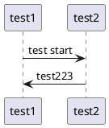

```text
@startuml
test1 -> test2: test start
test2 -> test1: test223
@enduml
```

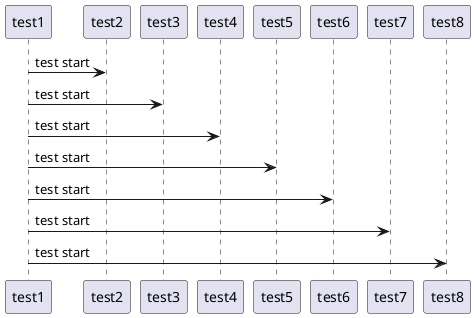
```text
@startuml
test1 -> test2: test start
test1 -> test3: test start
test1 -> test4: test start
test1 -> test5: test start
test1 -> test6: test start
test1 -> test7: test start
test1 -> test8: test start
@enduml
```

### participant
- paricipant
- actor
- boundary
- control
- entity
- database
- collections
- queue

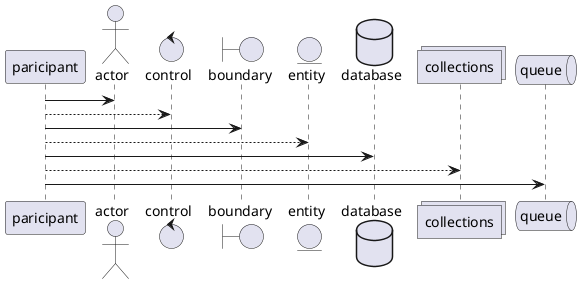

```text
@startuml
participant paricipant as foo1
actor actor as foo2
control control as foo3
boundary boundary as foo4
entity entity as foo5
database database as foo6
collections collections as foo7
queue queue as foo8

foo1 -> foo2
foo1 --> foo3
foo1 -> foo4
foo1 --> foo5
foo1 -> foo6
foo1 --> foo7
foo1 -> foo8
@enduml
```

### order

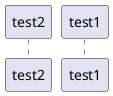

```text
@startuml
participant test1 order 20
participant test2 order 10
@enduml
```

### 여러 줄
```plantuml
@startuml
participant test1 [
    test
    ----
    test
]
@enduml
```

```text
@startuml
participant test1 [
    test
    ----
    test
]
@enduml
```

### 특수문자

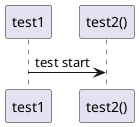

```text
@startuml
"test1" -> "test2()": test start
@enduml
```

### mySelf

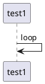

```text
@startuml
test1 -> test1: loop
@enduml
```

### Text Align
```plantuml
@startuml
skinparam sequenceMessageAlign left
testtesttest1 -> testtesttest2: test start
@enduml

@startuml
skinparam sequenceMessageAlign right
testtesttest1 -> testtesttest2: test start
@enduml

@startuml
skinparam sequenceMessageAlign center
testtesttest1 -> testtesttest2: test start
@enduml

@startuml
skinparam responseMessageBelowArrow true
testtesttest1 -> testtesttest2: test
testtesttest2 -> testtesttest1: start
@enduml
```

```text
@startuml
skinparam sequenceMessageAlign left
testtesttest1 -> testtesttest2: test start
@enduml

@startuml
skinparam sequenceMessageAlign right
testtesttest1 -> testtesttest2: test start
@enduml

@startuml
skinparam sequenceMessageAlign center
testtesttest1 -> testtesttest2: test start
@enduml

@startuml
skinparam responseMessageBelowArrow true
testtesttest1 -> testtesttest2: test
testtesttest2 -> testtesttest1: start
@enduml
```


### Arrow Color

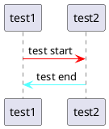

```text
@startuml
test1 -[#red]> test2: test start
test2 -[#55ffff]> test1: test end
@enduml
```

### number
```plantuml
@startuml
autonumber
test1 -> test2: start
test2 -> test1: end
@enduml

@startuml
autonumber 15
test1 -> test2: start
test2 -> test1: end
@enduml

@startuml
autonumber 5 "<b>[000]"
test1 -> test2: start
test2 -> test1: end
@enduml

@startuml
autonumber 100 "<b>(<u>##</u>)"
test1 -> test2: start
test2 -> test1: end
@enduml

@startuml
autonumber 100 "<font color=red><b>(<u>##</u>)"
test1 -> test2: start
test2 -> test1: end
@enduml

@startuml
autonumber 100 "<font color=ff55ff><b>(<u>##</u>)"
test1 -> test2: start
test2 -> test1: end
@enduml
```

```text
@startuml
autonumber
test1 -> test2: start
test2 -> test1: end
@enduml

@startuml
autonumber 15
test1 -> test2: start
test2 -> test1: end
@enduml

@startuml
autonumber 5 "<b>[000]"
test1 -> test2: start
test2 -> test1: end
@enduml

@startuml
autonumber 100 "<b>(<u>##</u>)"
test1 -> test2: start
test2 -> test1: end
@enduml

@startuml
autonumber 100 "<font color=red><b>(<u>##</u>)"
test1 -> test2: start
test2 -> test1: end
@enduml

@startuml
autonumber 100 "<font color=ff55ff><b>(<u>##</u>)"
test1 -> test2: start
test2 -> test1: end
@enduml
```
### note

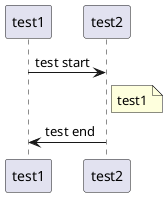

```text
@startuml
test1 -> test2: test start
note right of test2
    test1
end note
test2 -> test1: test end
@enduml
```

### new page

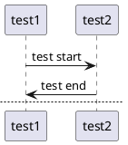

```text
@startuml

test1 -> test2: test start
test2 -> test1: test end

newpage A title

test2 -> test1: test start
test1 -> test2: test end

@enduml
```

### 페이지 제목, 머리말 꼬리말
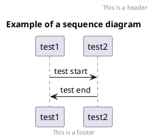

```text
@startuml

header This is a header
footer This is a footer

title Example of a sequence diagram

test1 -> test2: test start
test2 -> test1: test end

@enduml

```

### group
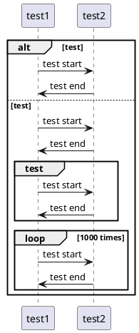

```text
@startuml

alt test
    test1 -> test2: test start
    test2 -> test1: test end

else test

    test1 -> test2: test start
    test2 -> test1: test end
    
    group test
        test1 -> test2: test start
        test2 -> test1: test end
    end
    
    loop 1000 times
        test1 -> test2: test start
        test2 -> test1: test end
    end

end

@enduml
```


